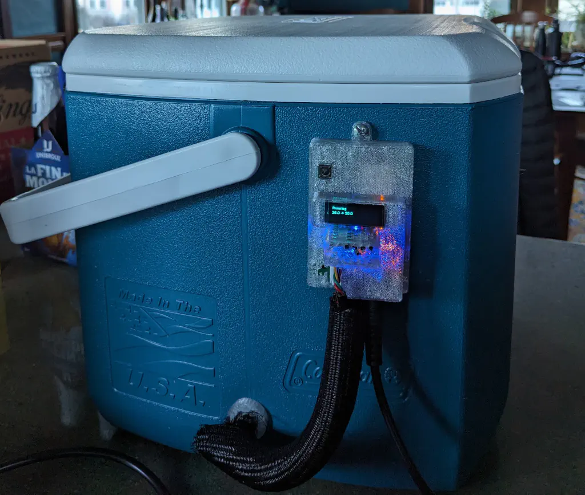
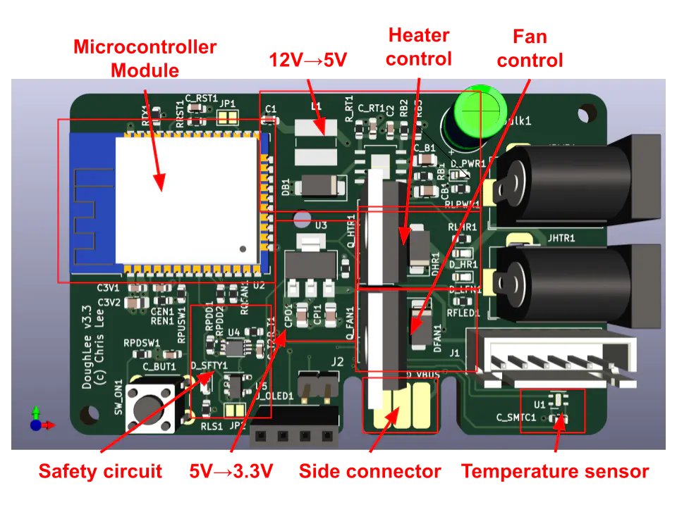
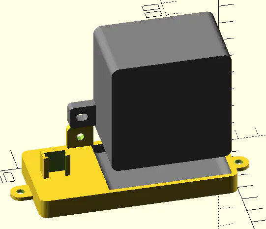
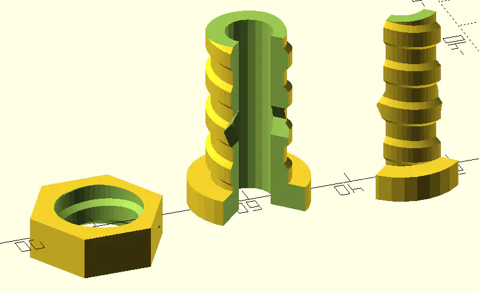

# Dough133

Dough133 is a temperature-controlled container for proofing and fermenting sourdough.
It uses a small cooler and a PTC heater with a fan to heat the inside of the cooler.
A PCBA with an ESP32 controls the power supplied to the heater to regulate
 the temperature of the enclosure.



This repository contains:
- KiCAD design for the PCB.
- Source code for the device firmware.
- OpenSCAD design for 3D printed components.

[Instructions for the assembly](https://selectiveappeal.org/posts/dough133-assembly/)
 of the device are in this are at my blog.

Please also see the other entries describing this project:
- [Dough133](https://selectiveappeal.org/posts/dough133/)
- [Dough133 Electronics Design](https://selectiveappeal.org/posts/dough133-electronics/)

Components needed for making this device, along with links and approximate price as of September
 2024:

| Item | Source  | Approximate cost  |
|---|---|---|
| Coleman 16 qt cooler | [Amazon](https://www.amazon.com/gp/product/B09HN13FN4) | $23 |
| PTC Air Heater 12V 100W | [AliExpress](https://www.aliexpress.us/item/3256803451720173.html) | $7 |
| DC 12V 5A Power Supply | [Amazon](https://www.amazon.com/gp/product/B01GEA8PQA)  | $12  |


## KiCAD

The circuit board design is in [KiCAD/](KiCAD/).



These require footprints in [`chl33_library`](https://github.com/chl33/chl33_library.pretty) and symbols in [`chl33_kicad_sym`](https://github.com/chl33/chl33_kicad_sym).


## OpenSCAD

Designs for 3D-printable components are in [scad/](scad/).

The EBox is based on the [ProjectBox](https://github.com/chl33/ProjectBox) OpenSCAD system.

The heater mount secures the heater and temperature/humidity sensor inside the cooler.



The Cooler plug helps avoid heat leaking through the hole through which wires run from the
 heater mount through the wall of the cooler to the EBox.




## Software

The software is based on the [og3](https://github.com/chl33/og3) library and built
 using [PlatformIO](https://platformio.org/).

### Features

*   **PID Temperature Control:** Uses a Proportional-Integral-Derivative controller with
      feedforward to maintain precise temperature.
*   **Web Interface:** Configure target temperature, view status, and tune PID settings
      via a web browser.
*   **Home Assistant Integration:** Supports MQTT auto-discovery for seamless integration
      with Home Assistant as a generic thermostat.
*   **OLED Display:** Shows current status, temperature, and IP address.
*   **Safety Features:** Includes max/min temperature limits, sensor error detection,
      and safety hardware to cut heater power if the microprocessor is not running properly.

### Getting Started

#### Prerequisites

*   [PlatformIO](https://platformio.org/install) (CLI or VSCode extension).

#### Configuration

The project uses `ini` files for local configuration and secrets. You need to create `secrets.ini` and `secrets-usb.ini` based on the provided examples.

1.  **General Secrets:**
    Copy `secrets.ini.example` to `secrets.ini` and configure:
    ```ini
    [secrets]
    udpLogTarget = 192, 168, 1, 100  ; Optional: IP for UDP logging
    otaPassword = my_secure_password ; Password for Over-The-Air updates
    ```

2.  **Upload Configuration:**
    For USB flashing, copy `secrets-usb.ini.example` to `secrets-usb.ini`:
    ```ini
    [secrets]
    uploadProtocol = esptool
    uploadPort = /dev/ttyUSB0      ; Check your specific port (e.g., COM3 on Windows)
    uploadAuth =
    uploadHostPort =
    ```
    *(For OTA updates later, you can use `secrets-ota.ini`)*

#### Building and Flashing

1.  Connect the ESP32 board to your computer via USB.
2.  Build and upload the firmware:
    ```bash
    pio run -t upload
    ```
3.  Monitor the serial output to verify startup:
    ```bash
    pio device monitor
    ```

### Usage

#### Physical Interface

*   **Button:** Press the physical button to toggle temperature control ON or OFF.
*   **OLED Screen:** Displays the current state (Off, Running, Cooling), current temperature, and target temperature.

#### Web Interface

Once connected to WiFi, navigate to the device's IP address (displayed on the OLED).
*   **Status Page:** View current temperatures (Enclosure, Room), humidity, and heater status.
*   **Controls:** Enable/Disable the heater.
*   **Configuration:** Set the target temperature, ramp rates, and PID gains.

#### Home Assistant

Ensure your MQTT broker details are configured in the Web UI.
The device will automatically appear in Home Assistant as a climate device
 (Thermostat) if MQTT discovery is enabled.
